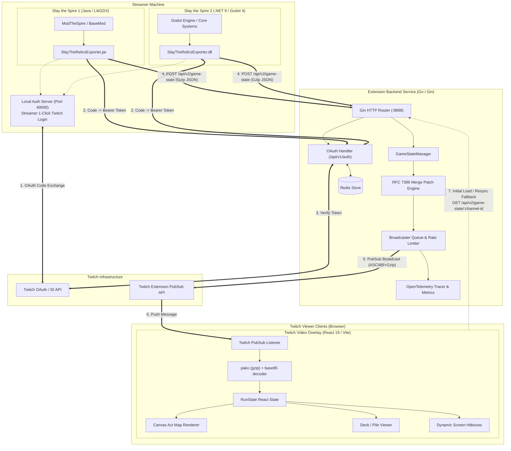

# Slay the Relics — Architecture & Codebase Layout

## 1. Executive Summary

**Slay the Relics** is a production Twitch Extension ecosystem that streams real-time, interactive game state from *Slay the Spire* (STS1) and *Slay the Spire 2* (STS2) directly to Twitch viewers. Viewers see an interactive overlay synchronized over the video stream, enabling them to hover over relics, cards, potions, powers, and view the act map, draw pile, discard pile, and exhaust pile as if they were interacting with the game client directly.

The project is structured as a monorepo consisting of:
1. **Game Exporters**: In-game mods for STS1 (Java / ModTheSpire) and STS2 (C# .NET 9 / Godot 4) that poll game state, normalize data into a shared schema, and push compressed JSON payloads over HTTP.
2. **Backend Service (EBS)**: A Go service that authenticates streamers, tracks active game states in memory, computes RFC 7396-inspired partial merge patches, compresses diffs, and broadcasts them via Twitch PubSub.
3. **Twitch Video Overlay Extension**: A React 19 / TypeScript single-page application hosted within the Twitch video player iframe that listens to PubSub broadcasts, reconciles state diffs, and renders interactive hitboxes and UI modals.
4. **Asset & Development Tooling**: Card extraction tools (`ImageExporter`), static localization data, and build scripts.

---

## 2. High-Level Architecture & Data Flow



### Data Pipeline Walkthrough

1. **Authentication**:
   - Streamer clicks "Connect with Twitch" in game settings.
   - The mod starts a temporary local HTTP server on `http://localhost:49000` and launches the system browser to Twitch's OAuth URL.
   - Twitch redirects to `localhost:49000/?code=...`. The local server captures the authorization code.
   - The mod sends `{ "code": "..." }` to the EBS endpoint `POST /api/v1/auth`.
   - EBS exchanges the code with Twitch, verifies the streamer identity, hashes the access token with `bcrypt`, stores it in Redis, and returns the User ID and Bearer AuthToken.
   - The mod saves credentials locally (`%AppData%/SlayTheRelicsExporter/config.json` on Windows or OS equivalent).

2. **Game State Polling & Serialization**:
   - The mod polls game singletons (`RunManager`, `CombatManager`, `RunState`, `Player`) on an interval (default: 1000ms).
   - In STS2, state access must be scheduled on the main thread via `Callable.From(...).CallDeferred()` due to Godot thread-safety constraints.
   - Mod builds an `ExportedState` object:
     - Relics: Titles and hover tips.
     - Deck & Piles: Card keys with variant annotations (`{cardId}\u001F{enchantment}\u001F{affliction}`).
     - Potions: Names and hover tips.
     - Map: Converted into column-indexed grid coordinates (`mapNodes[row][col]`, `mapPath`).
     - Combat Power Tips: Creature UI hitboxes converted into screen percentages (`0%` to `100%`).
   - The mod Gzip-compresses the JSON payload and sends `POST /api/v2/game-state` with `Authorization: Bearer <token>` and `User-ID: <channel>`.

3. **Backend Diffing & Compression**:
   - The EBS validates the Bearer token against Redis (using an in-memory token cache for low-latency hits).
   - The EBS compares the new `GameState` against the cached `GameState` for the streamer.
   - If `gameStateIndex == 0` (new run) or no prior state exists, the full state is sent.
   - If `gameStateIndex` has advanced, `computeMergePatch` performs an RFC 7396-style diff:
     - Map fields (`cardTips`, `relicTipMap`): Per-key diff (only changed or newly added keys are sent).
     - Array / Primitive fields: Replaced if changed, omitted if identical.
     - Unchanged fields are completely omitted from the payload.
   - If nothing changed (patch has only `gameStateIndex` and `channel`), broadcast is skipped.
   - The payload is JSON-marshaled, Gzip-compressed (level: `BestCompression`), ASCII85-encoded into `<~...~>`, and sent to Twitch PubSub.

4. **Viewer Extension Ingestion & Rendering**:
   - On initial mount, the extension fetches static localization JSON and calls `GET /api/v2/game-state/:channel-id` to load the full snapshot.
   - In real time, `window.Twitch.ext.listen("broadcast", ...)` receives PubSub frames.
   - Frames are decoded via `base85` and decompressed via `pako` (gzip).
   - Consecutive indexes (`prevIndex + 1 == newIndex`) are merged into React state (`setStateUpdate`).
   - If messages are dropped (`prevIndex + 1 < newIndex`), the extension automatically triggers a REST sync fetch (`fetchState`) from EBS.

---

## 3. Repository Layout

```
slaytherelics/
├── ARCHITECTURE.md                  # This document
├── LICENSE                          # GPL-3.0 License
├── PRIVACY.md                       # Privacy policy for Twitch Extension
├── README.md                        # Project landing page & user install guide
├── assets/                          # Static assets and game media
│   ├── sts1/                        # Slay the Spire 1 assets
│   │   ├── card-images/             # STS1 card portraits (.png, plus1 suffix)
│   │   └── localization/            # STS1 cards.json, keywords.json, potions.json, relics.json
│   └── sts2/                        # Slay the Spire 2 assets
│       └── card-images/             # STS2 card renders exported via ImageExporter
├── backend/                         # Go Extension Backend Service (EBS)
│   ├── api/                         # Gin route handlers, auth middleware, and legacy v1 compat
│   │   ├── api.go                   # API struct, routing table, logger config
│   │   ├── auth.go                  # /api/v1/auth and /api/v1/login handlers
│   │   ├── game_state.go            # POST /api/v2/game-state & GET /api/v2/game-state/:channel-id
│   │   ├── message.go               # v1 POST /api/v1/message handler
│   │   ├── old_message.go           # Legacy v1 unversioned POST handler
│   │   └── deck.go                  # GET /deck/:name handler and v1 deck decompressor
│   ├── client/                      # External service clients
│   │   ├── twitch.go                # Twitch Helix API & PubSub client
│   │   └── redis.go                 # Redis client initialization
│   ├── config/                      # Kong environment variable configuration
│   ├── errors/                      # Typed error definitions (AuthError, Timeout)
│   ├── models/                      # Internal data models (User)
│   ├── o11y/                        # OpenTelemetry tracing, metrics, and HTTP middleware
│   ├── otel_config/                 # Local OpenTelemetry collector configuration
│   ├── scripts/                     # Linting, imports, dev-tools, and test shell scripts
│   ├── slaytherelics/               # Core business logic
│   │   ├── game_state.go            # GameState schema, computeMergePatch, compressJson
│   │   ├── broadcaster.go           # Sender worker pool, rate-limiting queue, keep-alive loop
│   │   ├── messages.go              # PubSub message dispatcher
│   │   ├── syncmap.go               # Generic thread-safe SyncMap[K, V]
│   │   └── users.go                 # Twitch OAuth validation, bcrypt hashing, Redis auth cache
│   ├── tools/                       # Go tool dependencies (golangci-lint, etc.)
│   ├── Dockerfile                   # Multi-stage production container build
│   ├── docker-compose.yml           # Local dev environment (EBS + Redis + OTel)
│   ├── Makefile                     # Build, lint, and test targets
│   ├── go.mod                       # Go 1.24 module definition
│   └── main.go                      # EBS entry point and pprof server
├── docs/                            # Design proposals, beta testing guides, review notes
│   ├── BETA.md                      # Beta testing instructions
│   ├── README.md                    # Original redesign proposal (v1 -> v2)
│   └── REVIEW_NOTES.md              # Notes submitted to Twitch Extension Reviewers
├── mod/                             # Slay the Spire 1 Java Mod
│   ├── src/main/java/str_exporter/  # Java source code
│   │   ├── SlayTheRelicsExporter.java# BaseMod entry point & ModPanel UI
│   │   ├── ModStatusImage.java      # Status indicator badge (healthy/error/auth)
│   │   ├── client/                  # EBSClient (HTTP communication with EBS)
│   │   ├── config/                  # Config, AuthManager, local AuthHttpServer
│   │   └── game_state/              # GameState snapshot builder, HitBox, MapNode, TipsBox
│   ├── src/main/resources/          # ModTheSpire.json, OAuth HTML templates, UI icons
│   ├── build.gradle.kts.example     # Gradle build script template
│   └── release-steam.sh             # Steam Workshop release packaging script
├── slay-the-relics-extension/       # Twitch Video Overlay Frontend (React 19 + TypeScript + Vite)
│   ├── public/                      # Static extension assets (icons, UI textures, power images)
│   │   └── img/                     # Map icons, orbs, powers, relics, UI controls
│   ├── src/                         # React components & application logic
│   │   ├── components/
│   │   │   ├── App/                 # App.tsx (root component, Twitch SDK, PubSub, state sync)
│   │   │   ├── Buttons/             # ReturnButton and UI controls
│   │   │   ├── Deck/                # Deck.tsx (CardGrid, CardView modal, Pile viewers, variant tag parser)
│   │   │   ├── Localization/        # Static localization context and GitHub CDN fetcher
│   │   │   ├── Potion/              # PotionBar.tsx (hitboxes and potion tooltips)
│   │   │   ├── Relic/               # Relic.tsx (RelicBar, dynamic hitbox pagination)
│   │   │   ├── SpireMap/            # SpireMap.tsx (HTML5 Canvas map rendering for STS1 & STS2)
│   │   │   └── Tip/                 # Tip.tsx (PowerTip, Hitbox, BBCode color tag parser, energy orbs)
│   │   ├── main.tsx                 # React DOM bootstrap
│   │   └── react-app-env.d.ts       # Global type definitions (Twitch SDK)
│   ├── video_overlay.html           # Twitch Extension video overlay entry HTML
│   ├── vite.config.mts              # Vite configuration (mkcert for local HTTPS)
│   ├── tsconfig.json                # TypeScript compiler configuration
│   └── package.json                 # Node dependencies and scripts
└── sts2-mod/                        # Slay the Spire 2 C# .NET 9 Godot Mod
    ├── SlayTheRelicsExporter/       # Main STS2 game state exporter mod
    │   ├── mod_manifest.json        # STS2 mod metadata manifest
    │   ├── src/
    │   │   ├── SlayTheRelicsExporterMod.cs # Mod entry point ([ModInitializer]), polling loop
    │   │   ├── StateExporter.cs     # RunManager/CombatManager state extractor & card variant encoder
    │   │   ├── BackendClient.cs     # HTTP POST with Gzip compression and Bearer auth
    │   │   ├── HitBoxReader.cs      # Reflection-based Godot UI node reader for creature hitboxes
    │   │   ├── MapTransformer.cs    # Coordinate transform from STS2 ActMap to STS1 grid
    │   │   ├── TipExporter.cs       # HoverTip extractor, mini-card resolver, enchantment tagging
    │   │   ├── InlineImageReplacer.cs# Replaces Godot [img] sprite fonts with [blue]/[gold] BBCode
    │   │   ├── AuthServer.cs        # HttpListener on port 49000 for Twitch OAuth code flow
    │   │   ├── Config.cs            # JSON config persistence (%AppData%/SlayTheRelicsExporter)
    │   │   ├── ModConfigBridge.cs   # Reflection bridge to ModConfig-STS2 settings menu
    │   │   ├── Models/              # ExportedState, MapNodeData, TipData, TipsBoxData
    │   │   └── Serialization/       # ModelIdJsonConverter and System.Text.Json options
    │   └── steam/                   # Steam Workshop packaging scripts and description
    ├── ImageExporter/               # Godot dev tool to export card renders to PNG
    │   ├── MainFile.cs              # Dev tool entry point
    │   ├── ImageExporterConsoleCmd.cs# Console command `imageexporter cards`
    │   └── project.godot            # Godot project file
    └── SlayTheRelicsExporter.Tests/ # C# unit tests
        ├── ConfigTests.cs           # Test config migration & persistence
        ├── InlineImageReplacerTests.cs # Test BBCode tag conversion
        ├── ModConfigBridgeTests.cs  # Test dynamic mod bridge loading
        └── Stubs/                   # Godot and logging stubs for CI execution
```

---

## 4. Component Deep Dives

### 4.1. Extension Backend Service (`backend/`)

The backend acts as an intelligent stateful relay between game exporters and the Twitch PubSub messaging network.

- **Framework & Dependencies**:
  - Language: Go 1.24
  - Router: Gin (`github.com/gin-gonic/gin`)
  - Storage: Redis 7 (`github.com/redis/go-redis/v9`)
  - Observability: OpenTelemetry Tracing (`go.opentelemetry.io/otel/trace`) and Metrics (`go.opentelemetry.io/otel/metric`)
  - CLI/Config: Kong (`github.com/alecthomas/kong`)

- **State Management & Diffing (`backend/slaytherelics/game_state.go`)**:
  - Maintains `GameStates SyncMap[string, GameState]` in memory.
  - `computeMergePatch(prev *GameState, update GameState) map[string]any`:
    - Evaluates field equality using reflection.
    - Fields with `map[string]` types (`cardTips`, `relicTipMap`) undergo key-by-key comparison via `diffMapKeys`. Only added or modified keys are placed into the patch.
    - Fields that have not changed are completely omitted.
    - Always attaches `gameStateIndex` and `channel`.
    - If the resulting patch contains only those 2 metadata keys, the update is dropped without network transmission.
  - `compressJson(data any) (string, error)`:
    - Encodes data to JSON.
    - Compresses with `gzip.BestCompression`.
    - Encodes with `ascii85` wrapped in `<~` and `~>`.
    - This keeps typical state updates under Twitch PubSub's strict 5 KB message size limit.

- **Broadcaster Queue (`backend/slaytherelics/broadcaster.go`)**:
  - Manages per-broadcaster `sender` goroutines to prevent PubSub rate-limit saturation.
  - Supports configurable stream delay (configured by streamer in mod settings) to synchronize the extension with video encoding lag.
  - Maintains a keep-alive worker that periodically flushes cached state if no updates occur.

- **Authentication & Security (`backend/slaytherelics/users.go` & `backend/api/game_state.go`)**:
  - Streamers authenticate with Twitch OAuth (`POST /api/v1/auth`).
  - Access tokens are hashed using `bcrypt` and stored in Redis.
  - Game state posts require `Authorization: Bearer <token>` and `User-ID: <channel>`.
  - In-memory `redisUserAuthCache` caches valid tokens to bypass Redis roundtrips on high-frequency state updates.
  - `DevMode` flag (`DEV_MODE=true`): Bypasses authentication headers and uses the channel ID from the request body for local testing.

---

### 4.2. Slay the Spire 2 Mod (`sts2-mod/`)

The STS2 mod runs inside the Godot 4 / .NET 9 environment of *Slay the Spire 2*.

- **Lifecycle & Threading (`SlayTheRelicsExporterMod.cs`)**:
  - Annotated with `[ModInitializer("Initialize")]` for discovery by STS2's mod loader.
  - Runs a background polling task (`Task.Run` with `CancellationToken`).
  - **Thread Safety**: Godot scene tree and game objects are strictly single-threaded. The polling task delegates state extraction to the main thread via `Callable.From(...).CallDeferred()` using `TaskCompletionSource<T>`.
  - Handles run boundary transitions: resets `gameStateIndex` to 0 when starting a new run or exiting to the main menu.

- **State Extraction (`StateExporter.cs`)**:
  - Queries `MegaCrit.Sts2.Core.Runs.RunManager.Instance.DebugOnlyGetState()` to read `RunState`.
  - Extracts character name, act boss encounter, total floor count.
  - **Relics**: Formatted display names and hover tip data.
  - **Deck & Combat Piles**: Card identifiers are serialized with variant annotations using the unit separator `\u001F`:
    ```
    {cardId}\u001F{enchantmentId}:{enchantmentAmount}\u001F{afflictionId}
    ```
    This format allows the frontend to distinguish identical cards with different upgrades, enchantments, or afflictions while retaining dictionary lookup capabilities.
  - **Combat State**: When in combat (`CombatManager.Instance.IsInProgress`), exports `DrawPile`, `DiscardPile`, and `ExhaustPile` (sorted by rarity then ID).

- **UI Hitbox Extraction (`HitBoxReader.cs`)**:
  - Uses reflection to inspect private `_creatureNodes` on `NCombatRoom.Instance`.
  - Reads `Control.GlobalPosition` and `Control.Size` from `NCreature.Hitbox`.
  - Converts logical coordinates (1920×1080) into percentage coordinates (`X / 1920 * 100`) compatible with the extension's responsive overlay.

- **Map Projection (`MapTransformer.cs`)**:
  - STS2 models maps as sparse coordinate grids (`MapPoint` with `(col, row)`).
  - STS1 models maps as dense row-by-column arrays (`mapNodes[row][col]` with parent column indexes).
  - `MapTransformer` projects STS2's `ActMap` into STS1's matrix format and extracts visited coordinates into `mapPath` so the existing extension map component renders STS2 maps with zero changes.

- **Card Image Exporter (`ImageExporter/`)**:
  - In-game developer utility activated via Godot console: `imageexporter cards [output_path]`.
  - Dynamically mounts `res://scenes/cards/card.tscn` in a headless `SubViewport`.
  - Upgrades and mutates cards programmatically, waits 3 frames for texture rendering, and extracts high-resolution 734×916 PNG assets with transparency.

---

### 4.3. Slay the Spire 1 Mod (`mod/`)

The STS1 mod runs in Java 8 on top of ModTheSpire and BaseMod.

- **Structure**:
  - `SlayTheRelicsExporter.java`: Implements `StartGameSubscriber`, `PostInitializeSubscriber`, `PostRenderSubscriber`.
  - `GameStateManager.java`: Runs a background thread that invokes `GameState.poll()` and dispatches JSON updates.
  - `GameState.java`: Directly extracts `AbstractDungeon.player.masterDeck`, `relics`, `potions`, and builds the map matrix from `AbstractDungeon.map`.
  - `Integrations.java`: Hooks into third-party mods such as `RelicStats` to include relic counter statistics in tooltips.
  - `EBSClient.java`: HTTP client communicating with `POST /api/v2/game-state`.

---

### 4.4. Twitch Video Overlay Extension (`slay-the-relics-extension/`)

The frontend is a client-side React 19 application built with Vite and TailwindCSS v4, packaged into a zip file for the Twitch Extension CDN.

- **Lifecycle & PubSub (`App.tsx`)**:
  - Initializes against `window.Twitch.ext`.
  - `onAuthorized`: Receives Twitch channel ID, fetches static localization files, and issues an initial HTTP GET to `/api/v2/game-state/:channel-id`.
  - `listen("broadcast", ...)`: Receives real-time state patches.
  - `decomp(body)`: Decodes ASCII85 and decompresses gzip using `pako`.
  - Merges partial updates into state. If an update index is skipped (packet loss), triggers `fetchState()` over HTTP to resynchronize.

- **Deck & Card Rendering (`Deck/Deck.tsx`)**:
  - Split into `DeckButton`, `CardGrid` (overlay modal), and `CardView` (full-size card inspection with arrow key navigation).
  - Supports 4 pile modes: Master Deck, Draw Pile, Discard Pile, Exhaust Pile.
  - Splits card keys on `\u001F` to dynamically render:
    - Base card image (routed to local assets or Slaytabase CDN).
    - Affliction overlays (e.g. `affliction_shattereda.png`).
    - Enchantment badges with count amounts.
    - Bottle relic indicators (Bottled Flame, Lightning, Tornado).
  - Dynamic damage/block calculation for scaling cards (e.g. *Genetic Algorithm*, *Ritual Dagger*, *Searing Blow*).

- **Map Rendering (`SpireMap/SpireMap.tsx`)**:
  - Renders the dungeon map on an HTML5 `<canvas>`.
  - Differentiates STS1 layout (tall, 15+ floors) vs STS2 layout (wider, shorter room distribution).
  - Draws dashed connection lines between rooms and their parents.
  - Highlights visited rooms with glowing blue circular outlines based on `mapPath`.

- **Tooltip System (`Tip/Tip.tsx`)**:
  - Renders floating tooltips using `react-tooltip`.
  - Supports both STS1 formatting (`#y` yellow, `#b` blue, `#r` red, `[E]` energy) and STS2 BBCode tags (`[gold]`, `[blue]`, `[red]`, `[green]`, `[purple]`).
  - Supports `CardHoverTip` mini card images embedded within hover tips.

---

## 5. Key Architecture Patterns & Protocols

### 5.1. Canonical State Schema (`GameState` / `ExportedState`)

Both STS1 and STS2 normalize their internal state into an identical JSON schema:

```json
{
  "gameStateIndex": 42,
  "channel": "12345678",
  "game": "sts2",
  "character": "Ironclad",
  "boss": "cerberus",
  "floor": 12,
  "relics": ["Burning Blood", "Vajra"],
  "relicTipMap": {
    "Burning Blood": [{ "header": "Burning Blood", "description": "Heal 6 HP at end of combat." }]
  },
  "deck": ["strike_ironclad", "bash", "strike_ironclad\u001Fburn:2\u001F"],
  "potions": ["Fire Potion", ""],
  "potionTips": [{ "header": "Fire Potion", "description": "Deal 20 damage." }],
  "drawPile": ["defend_ironclad", "strike_ironclad"],
  "discardPile": ["bash"],
  "exhaustPile": [],
  "mapNodes": [
    [{"type": "M", "parents": []}, {"type": "?", "parents": []}],
    [{"type": "E", "parents": [0, 1]}]
  ],
  "mapPath": [[0, 0], [0, 1]],
  "bottles": [-1, -1, -1],
  "potionX": 33.0,
  "additionalTips": [
    {
      "hitbox": { "x": 45.2, "y": 62.1, "w": 8.5, "h": 12.0, "z": 1 },
      "tips": [{ "header": "Vulnerable", "description": "Takes 50% more damage." }]
    }
  ],
  "staticTips": []
}
```

### 5.2. RFC 7396-Inspired Merge Patching

To minimize bandwidth over Twitch PubSub (maximum 5 KB per message):
- Unchanged top-level fields are omitted from the broadcast.
- Dictionary fields (`cardTips`, `relicTipMap`) undergo key-level diffing: only modified or newly introduced keys are included in the payload.
- Array fields (`deck`, `drawPile`, `discardPile`, `potions`, `relics`) are replaced in full when changed.
- Streamers with static screens produce no network packets after the first frame.

### 5.3. Multi-Game Support Strategy

The system handles differences between STS1 and STS2 transparently:
1. **Game Detection**: The `game: "sts2"` attribute signals the frontend to adjust layout coordinates (relic bar spacing, map button position, pile button offsets).
2. **Card Images**: STS1 card images are fetched from `assets/sts1/card-images/` or Slaytabase; STS2 card images are fetched from `assets/sts2/card-images/` generated by `ImageExporter`.
3. **Rich Text Formatting**: `Tip.tsx` tests for `[` to parse STS2 BBCode color tags, falling back to STS1 space-delimited `#y`/`#b` tokens.
4. **Card Variants**: STS2 enchantments and afflictions are packed into card keys with `\u001F`, preserving string compatibility across the pipeline.

---

## 6. Developer & AI Agent Operations Guide

### 6.1. Building and Running the Components

#### Backend (Go)
```bash
cd backend

# Install dev tools (golangci-lint, goimports)
make install-dev-tools

# Run tests
make test

# Run linter
make lint

# Start local dependencies (Redis + OTel)
docker compose up -d

# Run backend locally in dev mode (skips Twitch auth requirement)
DEV_MODE=true REDIS_ADDR=localhost:6379 LISTEN_ADDR=:8888 go run main.go
```

#### Twitch Extension Frontend (React / Vite)
```bash
cd slay-the-relics-extension

# Install dependencies
yarn install

# Run Vite dev server (runs on https://localhost:5173 with mock channel ID)
yarn dev

# Lint & format
yarn lint

# Build production bundle (generates build.zip for Twitch Developer Console upload)
yarn build
```

#### Slay the Spire 2 Mod (C# .NET 9)
```bash
cd sts2-mod/SlayTheRelicsExporter

# Configure local STS2 game directory in Directory.Build.props:
# <Project><PropertyGroup><STS2GameDir>/path/to/game/data</STS2GameDir></PropertyGroup></Project>

# Run unit tests
dotnet test ../SlayTheRelicsExporter.Tests/SlayTheRelicsExporter.Tests.csproj

# Build Release DLL
dotnet build -c Release
```

#### Slay the Spire 1 Mod (Java / Gradle)
```bash
cd mod
./gradlew build
```

---

### 6.2. Common Extension Scenarios (Agent Cheatsheet)

| Task | Files to Touch | Key Considerations |
|---|---|---|
| **Add a new STS2 mechanic (e.g. new card modifier)** | `sts2-mod/.../StateExporter.cs`<br/>`slay-the-relics-extension/.../Deck.tsx` | Extend `GetCardKey()` in C# with `\u001F` delimiter. Parse modifier in `Deck.tsx` and render overlay icon or badge. |
| **Add a new GameState field** | `backend/slaytherelics/game_state.go`<br/>`sts2-mod/.../Models/ExportedState.cs`<br/>`slay-the-relics-extension/.../App.tsx` | Ensure field is annotated with `json:"...,omitempty"` in Go. If a map, `computeMergePatch` will handle key-level diffing automatically. |
| **Adjust Hitbox / UI alignment** | `slay-the-relics-extension/.../Relic.tsx`<br/>`Potion.tsx`<br/>`Deck.tsx`<br/>`SpireMap.tsx` | Check whether alignment condition requires `props.game === "sts2"`. Coordinates are percentages relative to 1920×1080. |
| **Add new backend API endpoint** | `backend/api/api.go`<br/>`backend/api/<feature>.go` | Register in `api.New()`. Include OpenTelemetry span (`o11y.Tracer.Start`). Apply auth check via `users.AuthenticateRedis` unless devMode. |
| **Update STS2 Card Images** | `sts2-mod/ImageExporter/` | Run `imageexporter cards` in the STS2 developer console, copy output PNGs to `assets/sts2/card-images/`. |
